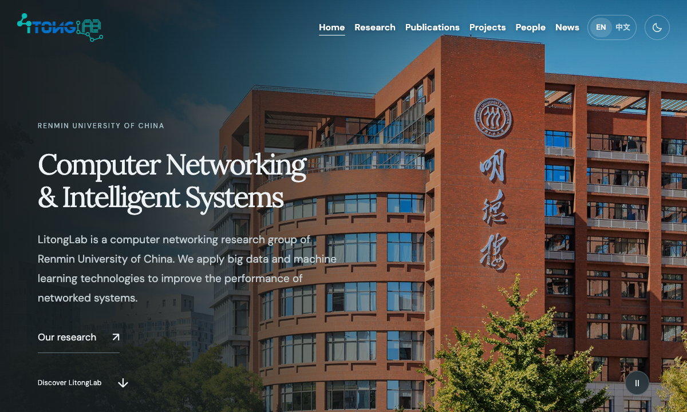
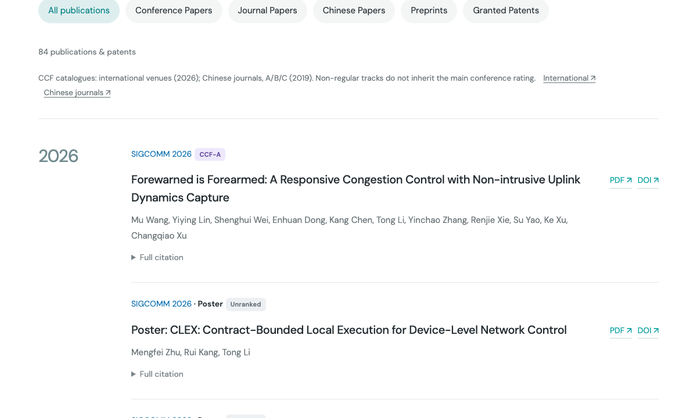
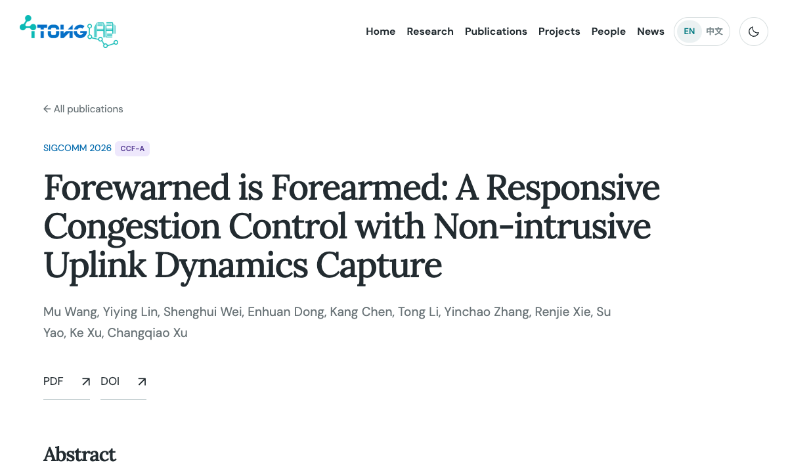
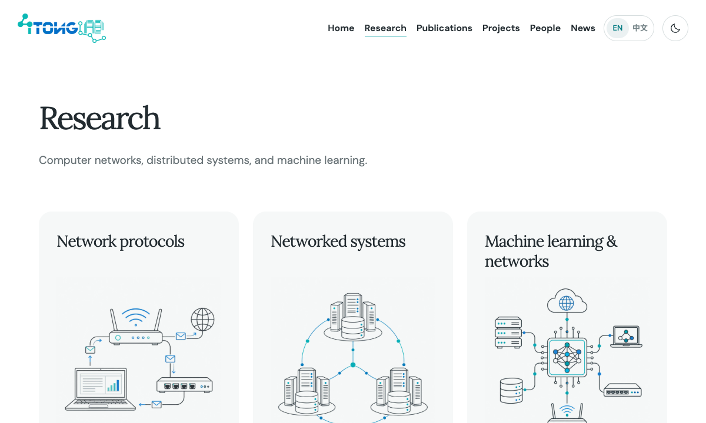
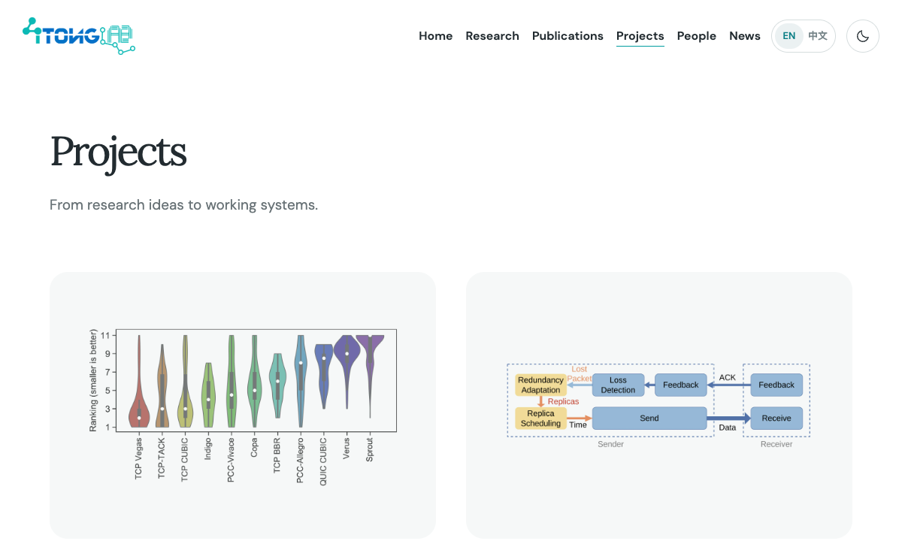
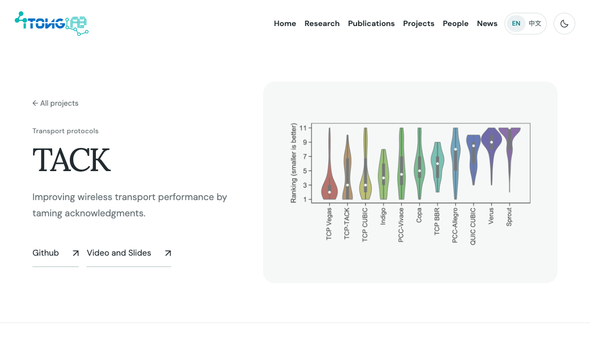
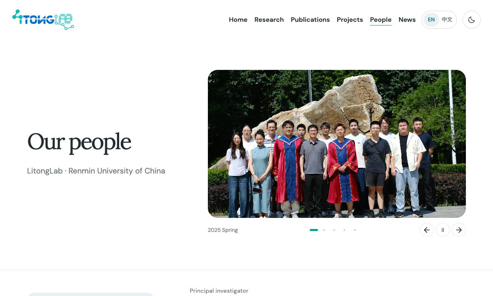
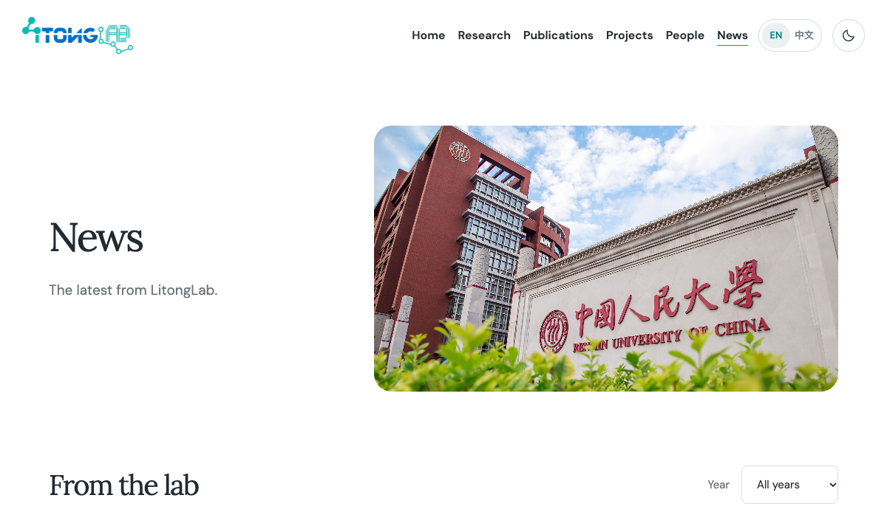
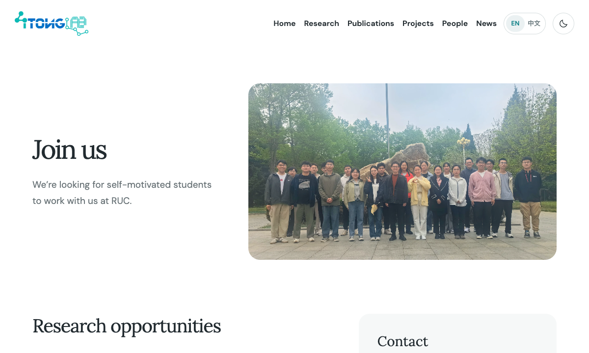
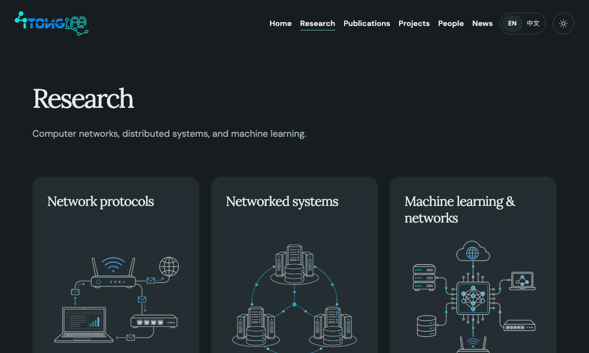

# 官网使用指南

## 1. 页面导航

点击顶部导航进入各栏目；手机上点击右上角菜单按钮展开导航。点击实验室 Logo 返回首页。

| 栏目                                                | 内容                                                   |
| --------------------------------------------------- | ------------------------------------------------------ |
| [首页](https://www.litonglab.com/)                  | 实验室介绍、研究方向、精选项目与论文、合影、最新动态   |
| [研究方向](https://www.litonglab.com/research/)     | 网络协议、网络系统、机器学习与网络，以及相关项目和论文 |
| [学术成果](https://www.litonglab.com/publications/) | 会议论文、期刊论文、中文论文、预印本与授权专利         |
| [研究项目](https://www.litonglab.com/projects/)     | 项目介绍、技术内容与相关资源                           |
| [团队成员](https://www.litonglab.com/people/)       | 教师、学生、毕业成员及实验室合影                       |
| [新闻动态](https://www.litonglab.com/news/)         | 论文录用、获奖、活动等实验室动态                       |
| [加入我们](https://www.litonglab.com/join/)         | 招生与科研机会、联系邮箱和地址                         |

## 2. 浏览首页

- 首屏播放校园与实验室短片，右下角按钮可暂停或继续播放；点击“了解 LitongLab”向下浏览。
- 点击研究方向卡片，跳到该方向的详细介绍。
- 向下滚动“研究与实践”区域，项目图片和介绍随之切换；点击圆点切换项目，点击“查看项目”进入详情。
- 点击代表性成果的图片或标题，进入该论文的独立页面。
- 团队合影自动轮播，可用左右箭头、圆点和暂停按钮控制。
- 各区域的“全部项目”“全部成果”“认识团队”“全部动态”进入完整列表。

## 3. 查找论文与专利

1. 打开“学术成果”。
2. 在搜索框输入题目、作者或会议／期刊名称，列表即时筛选。
3. 选择年份，再点击成果类别；搜索、年份和类别可以组合使用。
4. 查看题目、作者、会议／期刊简称、年份和 CCF 等级；Poster、Workshop 等类型显示在名称后。
5. 点击论文标题进入独立页面，查看摘要、论文配图、完整引用和相关链接；PDF、DOI 等链接会在新标签页打开。
6. 点击“重置筛选”恢复全部列表。

## 4. 了解研究方向与项目

在“研究方向”页点击方向卡片，页面滚动到对应介绍。点击项目名称进入项目详情，点击相关论文标题进入论文独立页面。

在“研究项目”页点击项目卡片，查看摘要、正文、示意图和关联论文。详情页中的 GitHub、论文、演示等链接打开相应资源；点击“全部项目”返回列表，点击底部“下一个项目”继续浏览。

## 5. 认识团队

“团队成员”按成员分组展示照片、姓名、身份和个人介绍。尚未上传照片的成员显示灰色头像占位；点击成员信息下方的个人主页等链接，访问相应页面。

页面下方的实验室生活相册可通过左右箭头或缩略图切换，照片下方显示对应标题。

## 6. 查看新闻与联系实验室

- “新闻动态”按年份展示。使用年份下拉框查看某一年的动态，选择“全部年份”恢复完整列表；条目下方的资源链接可打开相关资料。
- “加入我们”介绍科研机会及加入方式。点击联系邮箱打开邮件应用，填写邮件并附上个人简历。
- 页脚同样提供联系邮箱、地址和学校官网入口；点击“返回顶部”回到页面上方。

## 7. 切换语言与主题

- 点击右上角语言滑块中的“中文”或“EN”，切换页面语言。
- 点击太阳／月亮按钮，切换浅色或深色主题。
- 浏览器会保留语言与主题选择，下次访问继续使用。

