# 维护指南

[后台管理](https://www.litonglab.com/admin/)

## 1. 登录与分工

1. 打开后台，输入用户名和密码，登录管理中心。
2. 管理员沿用已有的 `admin` 账号；其他人员使用管理员分配的账号。
3. 完成操作后，点击右上角“退出”。

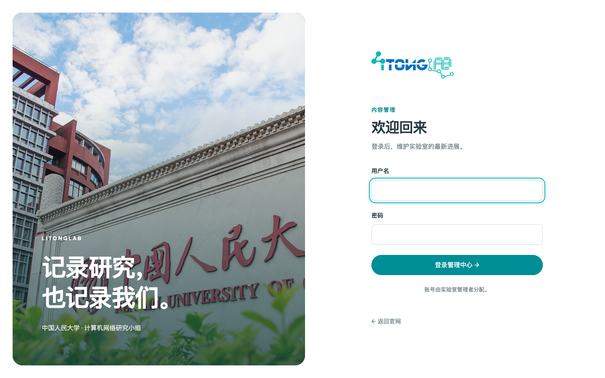

| 页签     | 用途                           | 可操作人员   |
| -------- | ------------------------------ | ------------ |
| 网页编辑 | 新增、修改、预览和发布内容     | 所有编辑人员 |
| 修改密码 | 修改自己的登录密码             | 所有编辑人员 |
| 创建账户 | 创建、编辑、停用和删除团队账号 | 管理员       |
| 备份还原 | 下载网站备份、还原内容和素材   | 管理员       |
| 编辑记录 | 查看修改人、时间和内容差异     | 所有编辑人员 |

首页固定介绍、Hero 文案和导航由开发者修改代码；“加入我们”的文字和照片可在页面上直接编辑。

## 2. 网页编辑：基本操作

### 2.1 找到需要维护的内容

1. 进入“网页编辑”，下方显示官网和编辑工具栏。
2. 点击“内容库”，选择新闻、论文、成员、项目、研究方向或首页展示；图片、视频和 PDF 在“素材库”中管理，合照轮播也在素材库中设置。
3. 在搜索框输入名称、论文作者或年份，点击目标条目打开右侧表单。
4. 新内容点击内容库中的“＋ 新增”；已有内容可点击侧栏底部“复制为新条目”后修改。

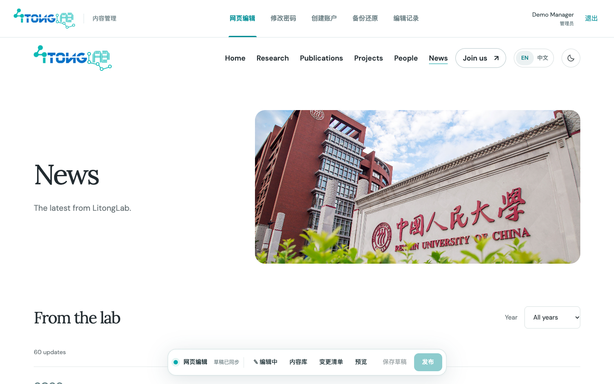

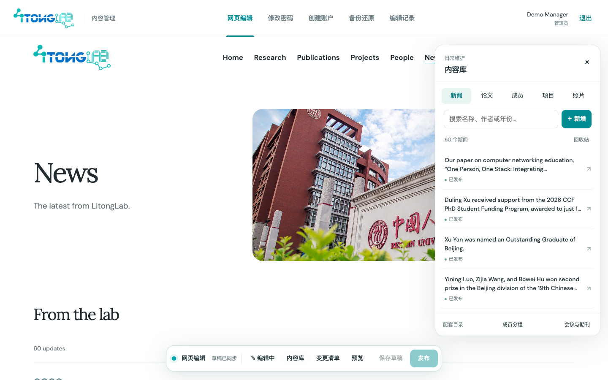

也可以直接点击网页中的文字或图片：文字原位输入后点“完成编辑”；图片打开素材库。点击条目空白处或“更多信息”打开完整表单。

点击工具栏的“编辑中”切换为“浏览中”，可正常使用官网链接；再次点击返回编辑。

### 2.2 填写中英文

1. 在条目表单顶部选择“中文”，填写中文字段。
2. 切换到“English”，填写对应的英文内容。
3. 日期、图片、分组、链接等共用字段只填写一次。

论文题目、作者和完整引用使用正式发表的原文，不随语言切换。

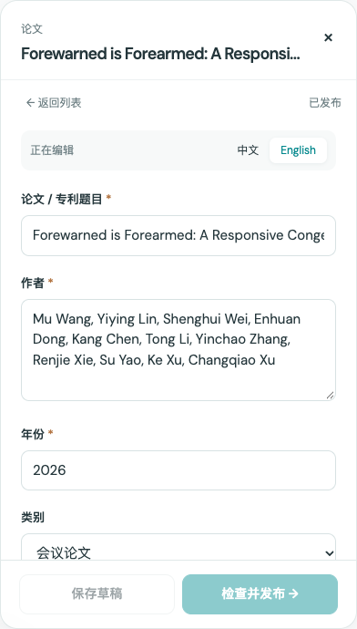

### 2.3 上传图片、PDF 和视频

1. 点击图片位置的“＋ 上传或选择”或“替换素材”；也可从“内容库”进入“素材库”统一整理文件。
2. 在“图片、视频、PDF、全部”中选择类型；图片还可按“合照照片、个人照片、论文配图、项目配图、其他图片”筛选。可用素材名称、英文名称或原始文件名搜索。
3. 上传前在“上传到”选择分类。上传 JPG、PNG 或 WebP 后，在图片上拖动框选显示区域，可选“页面比例”“自由”“1:1”“4:3”“16:9”“合照 1.85:1”；点击“裁切并上传”。不裁切时点“上传原图”。
4. 从条目进入素材库时，上传或点击现有文件会填入该条目；从“内容库”进入时，上传后留在素材库。
5. 点击文件的“重命名”，修改素材库中的显示名称，文件地址保持不变；其他图片可用卡片上的“分类”重新归类。未被草稿或官网使用的上传文件可点“删除”再确认；内置素材不能删除。
   论文 PDF 默认以论文题目显示；论文插图会按内容标为“【架构图】论文题目”或“【论文配图】论文题目”。
6. 添加论文 PDF 时，在链接区域点击“＋ 添加链接”，链接文字填 `PDF`，再点“选择文件”上传或选用 PDF。
7. 外部文件或代码仓库可直接填写链接地址；不需要的链接点击“移除”。

支持 JPG、PNG、WebP、GIF、ICO、MP4 和 PDF，单文件最大 50 MB。上传后的内容需发布才会展示在官网。

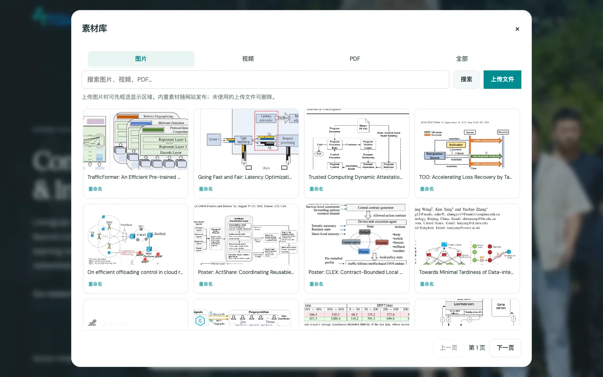

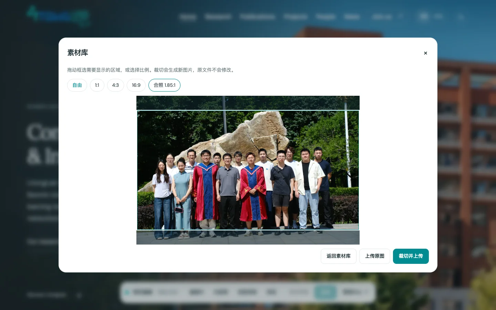

### 2.4 调整显示顺序

1. 打开条目，找到侧栏底部“显示位置”。
2. 点击“上移”“下移”逐项调整，或点“置顶”移到本组第一位。
3. 点击“自动位置”恢复自动排列。

| 内容             | 排列方式                                 |
| ---------------- | ---------------------------------------- |
| 新闻             | 日期从新到旧；按钮调整同一天内的顺序     |
| 论文             | 年份从新到旧；按钮调整同一年内的顺序     |
| 成员             | 在所属成员分组中调整顺序                 |
| 合照             | 在素材卡片上用“上移、下移、置顶”调整     |
| 项目、分组、会刊 | 按按钮调整；“自动位置”恢复最近保存的顺序 |

新闻、论文、成员的“自动位置”恢复最近保存的组内位置，新条目放到组末。移动后受影响的相邻条目会一起列为修改，保存和发布时一并处理。

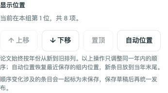

### 2.5 检查、保存和发布

1. 点击“变更清单”，核对“上次保存的草稿 / 当前编辑”或“当前官网 / 已保存草稿”。
2. 点击“预览”，分别查看“桌面”和“手机 · 390px”；预览包含尚未保存的修改。
3. 点击“保存草稿”，或按 `Ctrl+S` / `⌘S`。草稿保存到服务器，官网仍显示原内容。
4. 点击工具栏“发布”或侧栏“检查并发布”。
5. 在“发布前确认”中勾选本次要上线的条目，点“确认发布 N 项”。未选中的草稿继续保留。
6. 打开官网，刷新对应页面，检查文字、图片和链接。

所有编辑人员都可以发布。切换管理页签保留当前编辑状态；关闭或刷新页面前先保存草稿。遇到编辑冲突，先复制需要保留的文字，再点击“重新加载”，合并其他人的修改。

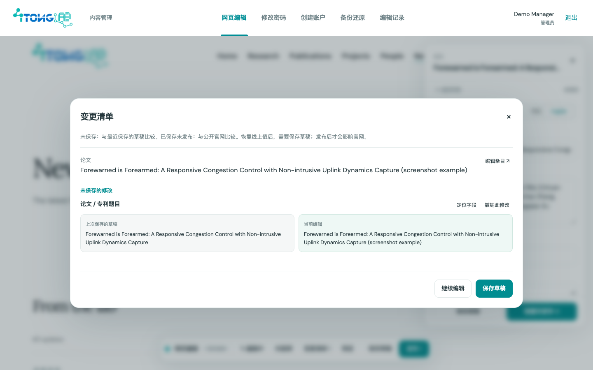

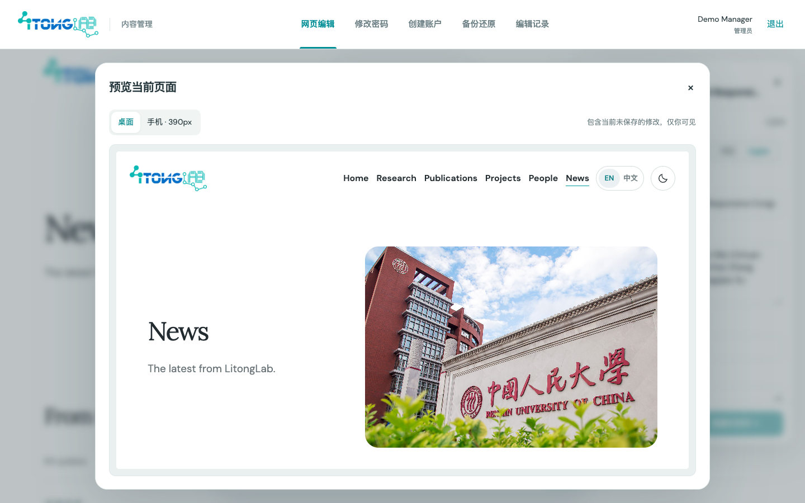

### 2.6 撤销误修改

点击“变更清单”，找到对应条目和字段：

- “定位字段”：回到修改位置并打开对应字段。
- “撤销此修改”：撤销该字段尚未保存的修改。
- “恢复线上值”：将已保存的草稿字段改回当前官网的值，再保存草稿；若全部恢复，发布按钮会停用。
- “清空此字段”：清空尚未发布的新条目字段。

要撤销整条内容尚未保存的修改，打开条目，点击侧栏底部“撤销本次修改”。


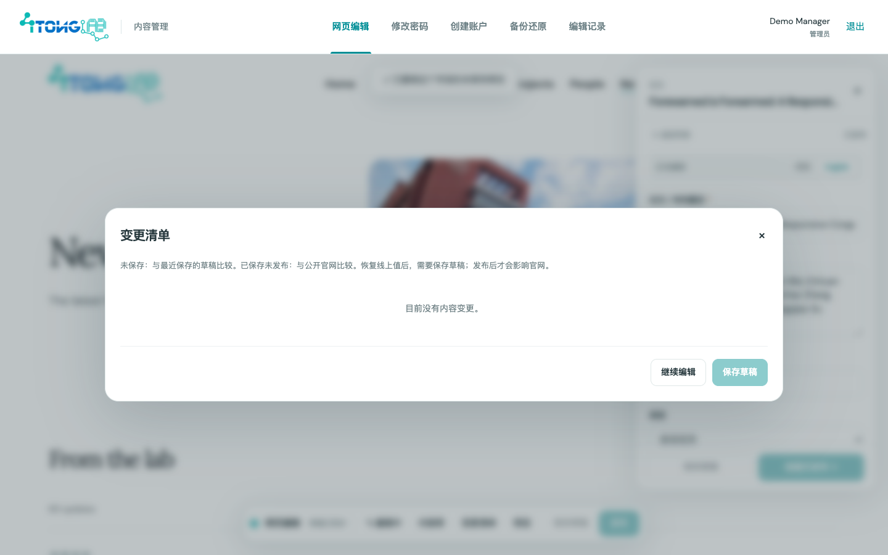

## 3. 网页编辑：各类内容

### 3.1 论文与专利

1. “内容库”→“论文”→“＋ 新增”；修改时搜索题目或作者后打开条目。
2. 填写“论文 / 专利题目”“作者”“年份”。题名、作者顺序与 PDF 一致，年份使用正式发表年份。
3. 选择类别：会议论文、期刊论文、中文论文、预印本或授权专利。
4. 在“选择会议 / 期刊目录”中选择会刊，名称和 CCF 评级会沿用目录；目录没有时，先按下文新增会刊。
5. 填写“发表类型”。正式论文选择“正式论文 / 不适用”；Poster、Demo、Workshop、Short Paper 等选择对应类型。
6. 填写“论文摘要”：先选“中文”填写中文，再切换“English”填写英文；只有一种语言时，详情页会显示已有版本。
7. 上传“论文图 / 海报主图”，优先使用该论文 PDF 中的架构图，并填写图片说明。没有图时保留占位图，取得正确素材后再替换。
8. 填写“完整引用”，在“论文、代码、演示等链接”中添加 PDF、代码仓库或项目网站。
9. 展开“更多发表信息”，按需填写 DOI、正式发表日期、卷期和页码。
10. 发布后点击论文标题进入独立页面，核对摘要、配图、链接、会刊简称、年份、发表类型和 CCF 徽章；打开 PDF 确认对应论文。

正文显示会刊简称，例如 `SIGCOMM 2026 CCF-A`。CCF 可选择 A、B、C 或未评级；留空则继承目录。独立的 Poster、Short Paper、Demo 和 Workshop 不继承主会评级；正式 Full/Regular paper 即使以海报形式展示，仍按正式论文填写。授权专利不显示 CCF 徽章。

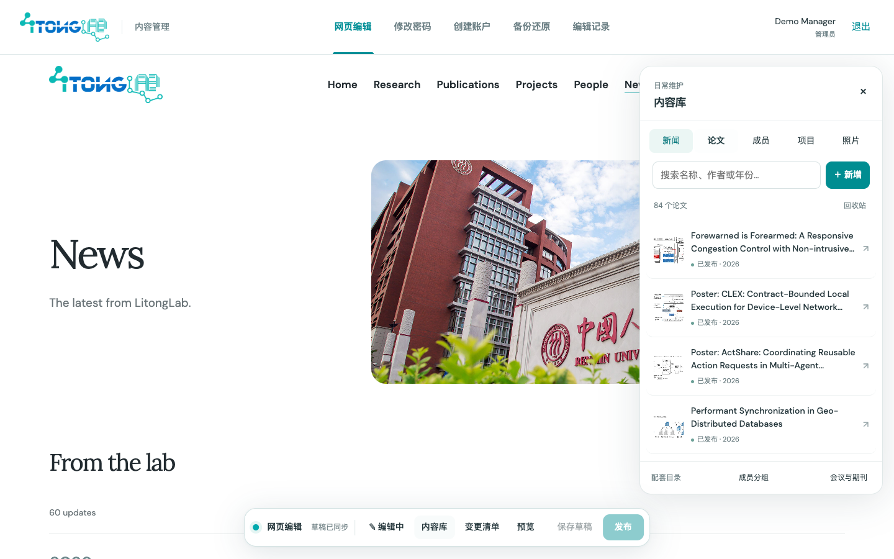

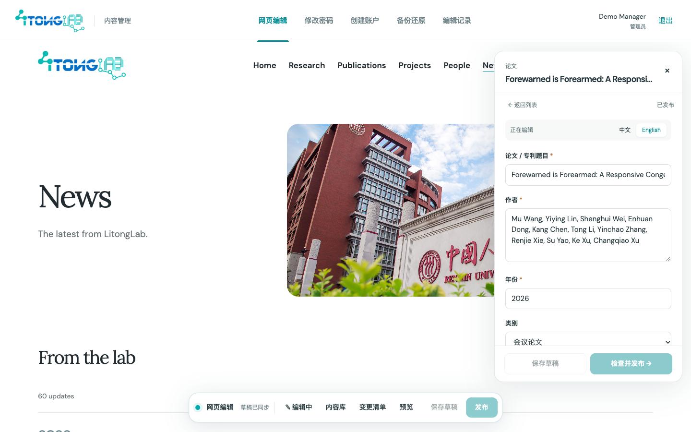

### 3.2 新闻

1. “内容库”→“新闻”→“＋ 新增”。
2. 分别填写中英文“新闻正文”。
3. 选择“新闻日期”和“新闻类别”：论文发表、获奖消息或实验室动态。
4. 按需添加配图和相关链接；链接文字使用“论文”“项目”“详情”等明确名称。
5. 发布后检查新闻页；日期较新的新闻会出现在首页最新动态中。

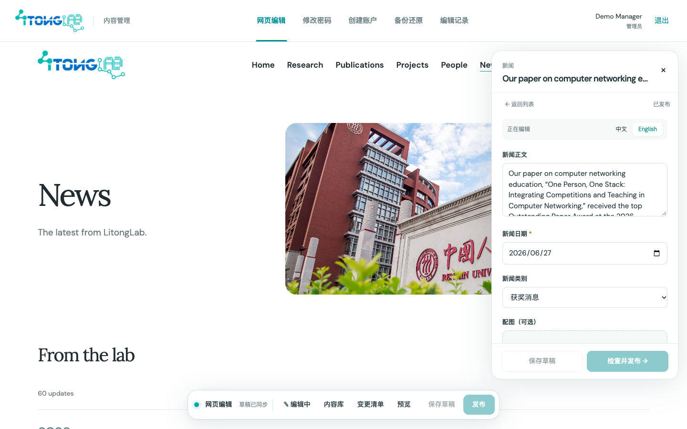

### 3.3 成员

1. “内容库”→“成员”→“＋ 新增”。
2. 填写中英文姓名，选择“所属分组”。没有合适分组时先新增成员分组。
3. 填写简介，上传个人生活照；选择导师分组时，还可填写“身份”。
4. 在上传窗口选择“1:1”并框选显示区域，确认后点击“裁切并上传”。导师与学生都使用方形照片。
5. 添加个人主页或邮箱链接；邮箱地址使用 `mailto:姓名@example.com` 格式。
6. 尚未上传照片的成员使用统一灰色头像；替换照片后，系统自动取消“当前为示例照片”。
7. 在“显示位置”调整组内顺序，预览成员页并发布。

成员毕业时，打开原条目，将“所属分组”改为对应校友分组，更新简介后发布。

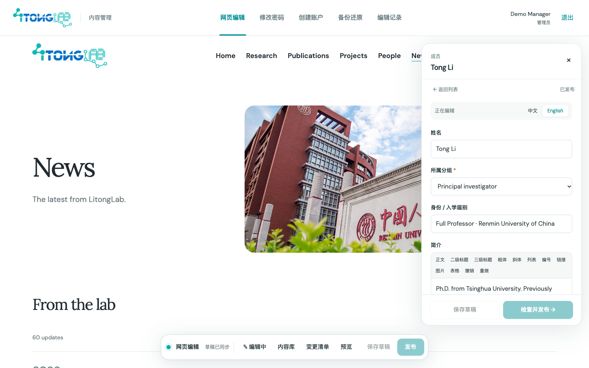

### 3.4 项目

1. “内容库”→“项目”→“＋ 新增”。
2. 填写“页面短名”，使用唯一的英文小写和连字符，例如 `network-project-2027`。
3. 分别填写中英文项目名称、所属领域、项目简介和完整介绍。
4. 上传“项目封面 / 系统图”；完整介绍可使用标题、列表、加粗和图片。
5. 在“相关论文”中勾选已有论文，项目页会沿用论文库内容；尚未录入的论文先到论文库新增。
6. 添加代码、论文或演示链接，点击“在页面中查看”检查项目详情后发布。

“复制为新条目”复制项目后，需要更换页面短名。已发布项目修改短名后，旧网址会跳转到新网址。

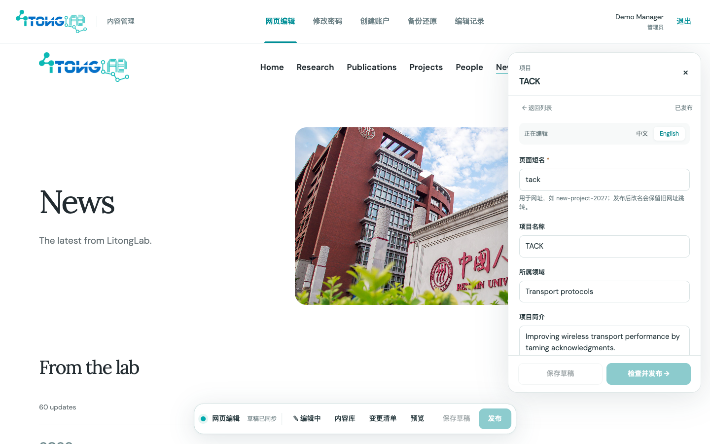

### 3.5 照片与轮播

1. “内容库”→“素材库”→“图片”→“合照照片”。点击“上传文件”，框选后上传；轮播照片数量不限。
2. 在照片卡片上勾选“首页轮播”或“成员页轮播”。取消对应勾选即可从该轮播移除；上传后未勾选的照片只存入素材库。
3. 用卡片上的“上移、下移、置顶”调整顺序。
4. 展开“中英文标题”，填写两种语言的照片标题。
5. 点击素材库上方“保存合照草稿”；确认后点击“发布合照”。也可关闭素材库，在工具栏查看变更、预览并统一发布。

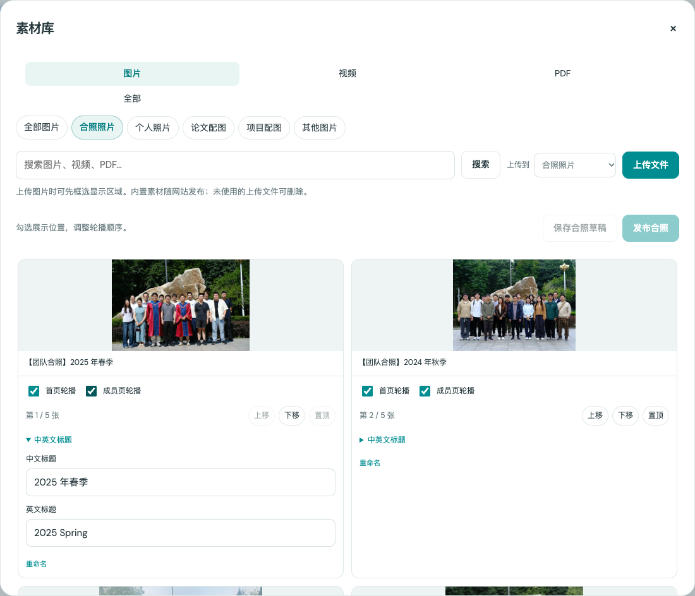

### 3.6 成员分组

1. 打开“内容库”，点击底部“成员分组”，再点“＋ 新增”。
2. 填写中英文分组名称。
3. “显示方式”选择“成员照片卡片”或“导师介绍”。
4. 调整分组位置，保存并发布。
5. 返回“成员”，将对应成员的“所属分组”改为新分组，再发布成员。

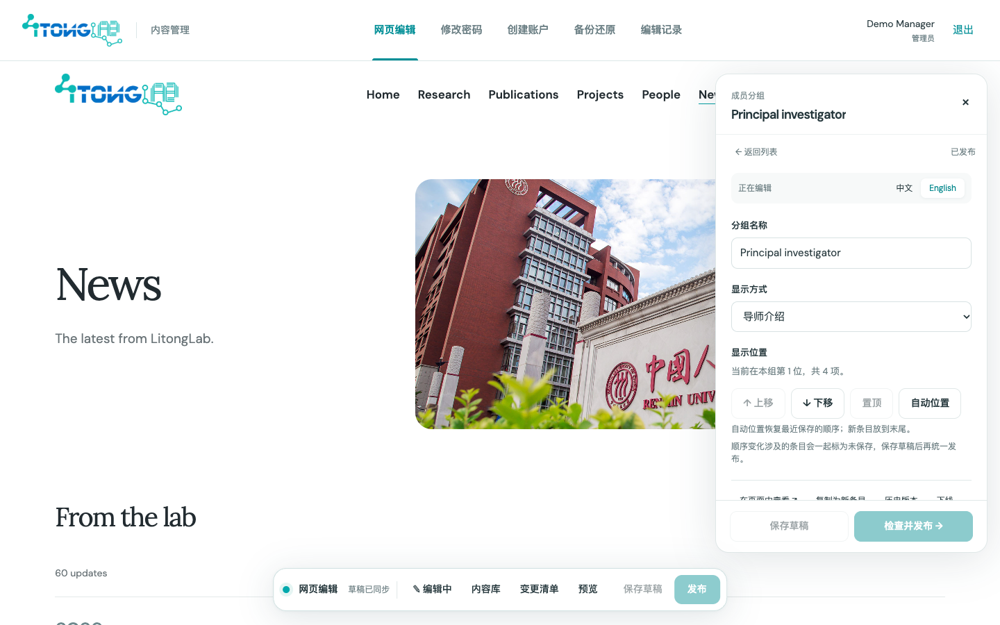

### 3.7 会议与期刊目录

1. 打开“内容库”，点击底部“会议与期刊”，再点“＋ 新增”。
2. 填写“会刊简称”和“完整名称”。
3. 选择“CCF 评级”，填写“目录版本”和“评级来源”链接；中文期刊按对应的中文目录填写。
4. 如需说明评级口径，填写“目录说明”。
5. 保存并发布，再到论文条目选择该会刊。

修改目录前确认其关联论文；目录中的简称和评级会供关联论文继承。论文有单独填写的覆盖值时，在该论文中修改或清空覆盖值。

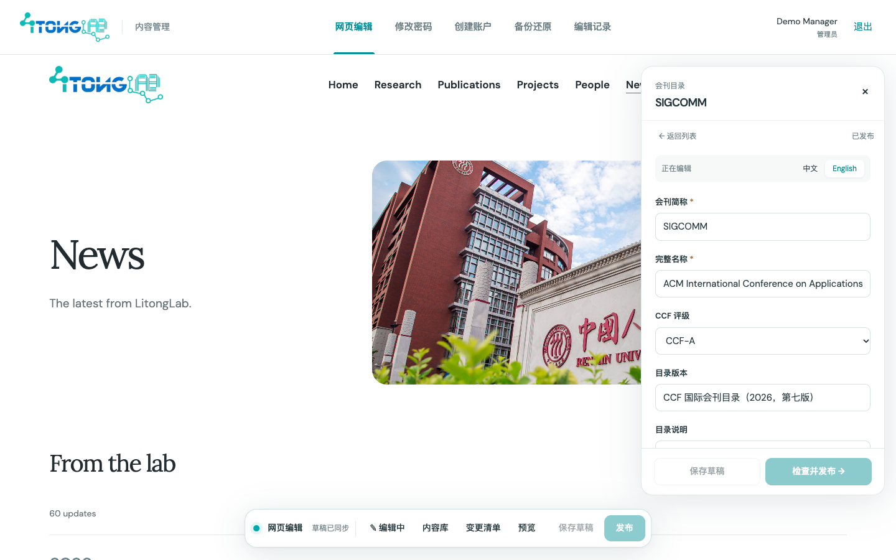

### 3.8 研究方向

1. “内容库”→“研究方向”→“＋ 新增”。
2. 填写中英文方向名称和简介，上传方向插图。
3. 勾选相关项目和论文；没有对应条目时先到项目库或论文库新增并发布。
4. 调整显示位置，保存并发布；首页与研究方向页同步显示。

### 3.9 首页展示

1. “内容库”→“首页展示”，打开唯一的配置条目。
2. 在“沉浸展示项目”下搜索并勾选项目，用已选列表中的“上移、下移、移除”调整展示内容和顺序。
3. 在“代表性论文”下搜索并勾选论文，同样调整顺序。
4. 按需修改照片轮播间隔和首页“加入我们”横幅照片。
5. 预览首页，保存并发布；项目和论文的文字、配图沿用对应条目。

### 3.10 加入我们

1. 在网页编辑中打开“加入我们”页面，保持工具栏为“编辑中”。
2. 点击页首小图或下方大图，上传或选择替换照片；两处照片同步更新。
3. 点击标题、简介或正文，直接输入文字，完成后点“完成编辑”。正文工具栏支持标题、列表、链接等排版。
4. 切换官网语言，分别填写中英文；点击联系邮箱打开联系信息表单，点击地址可直接修改。
5. 点击“保存草稿”，预览两种语言后发布。在变更清单中可定位、撤销具体字段。


## 4. 历史恢复、下线与回收站

### 恢复以前的版本

1. 打开内容条目，在侧栏底部点击“历史版本”。
2. 按操作人和时间选择版本，展开查看内容。
3. 点击“恢复此版本为草稿”。
4. 检查恢复结果，再发布。

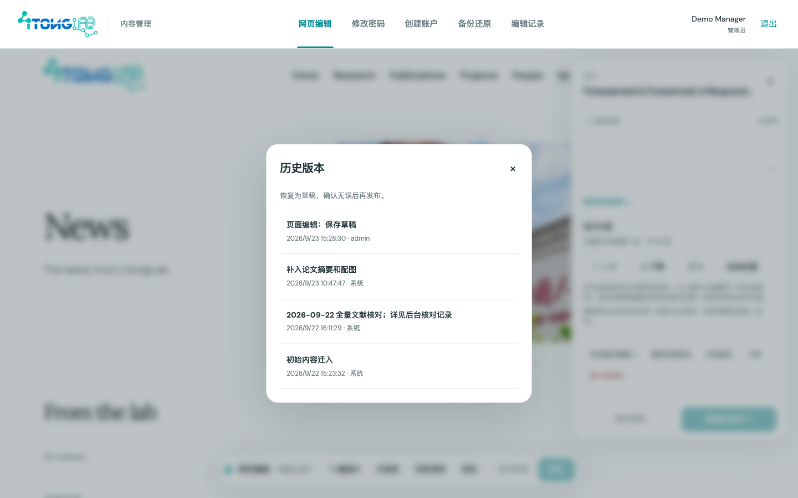

### 下线与删除内容

1. 暂时停止展示：打开条目，点击“下线”，确认后从官网移除，草稿仍保留。
2. 移除条目：点击“移入回收站”并确认，同时从官网下线。
3. 找回条目：进入对应类型的“内容库”→“回收站”，打开条目，点“恢复为草稿”并确认，再检查、发布。

若提示条目仍被引用，先修改相关成员、项目或论文，解除引用后再操作。

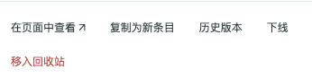

## 5. 修改密码

1. 打开“修改密码”。
2. 输入“当前密码”“新密码”“确认新密码”。新密码至少 12 位，不能是纯数字、常见密码或与用户名过于相似。
3. 点击“保存新密码”；成功后当前登录保持有效。

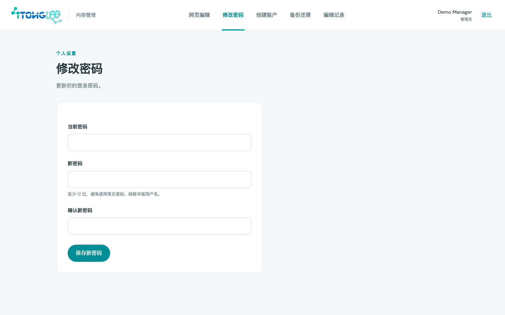

## 6. 创建与管理账户

### 创建账号

1. 管理员打开“创建账户”。
2. 在“新增团队账户”填写姓名、登录用户名、初始密码和确认密码。
3. 普通编辑人员不勾选“设为管理员”；需要管理账户和备份还原时再勾选。
4. 点击“创建账户”，将用户名和初始密码交给本人，由本人登录后修改密码。

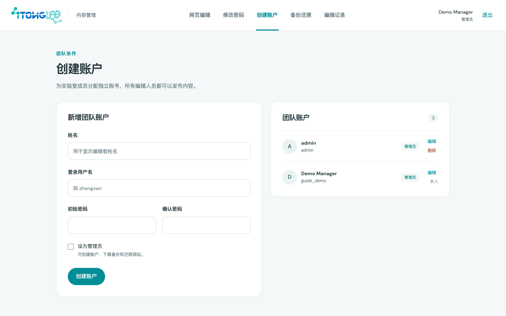

### 编辑、停用和删除账号

1. 在“团队账户”找到目标账号，点击“编辑”。
2. 修改姓名、登录用户名或管理员角色；重置密码时填写“新密码”和“确认密码”，留空则保留原密码。
3. 取消“允许此账户登录”可停用账号；重新勾选可启用。
4. 点击“保存账户修改”。
5. 删除账号时，点击其旁边的“删除”，再点“确认删除账户”。已有网站内容和编辑记录会保留。

当前登录账号不能删除、停用或取消自己的管理员角色。

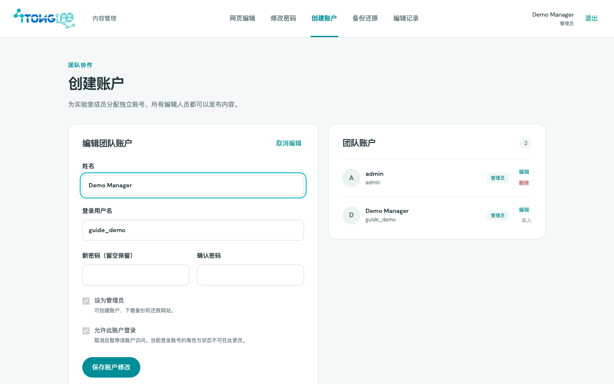

## 7. 备份还原

### 下载备份

1. 管理员打开“备份还原”。
2. 点击“下载网站备份 ↓”，等待 ZIP 下载完成。
3. 按日期保存备份文件；批量更新内容前先下载一份。

备份包含网站内容、草稿、发布状态、历史版本、回收站和素材；账号、密码、程序和服务器配置不在此 ZIP 中。

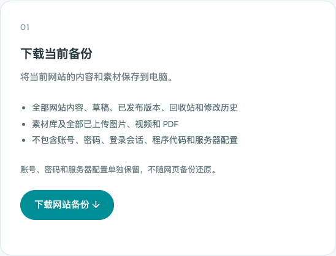

### 还原备份

1. 先保存或撤销“网页编辑”中未保存的修改。
2. 在“备份还原”点击“选择备份文件”，选择本页下载的 ZIP，最大 512 MiB。
3. 点击“检查备份内容”，核对备份时间、内容条目、素材文件和历史版本数量。
4. 点击“还原这个备份 →”，勾选“我确认将当前网站内容替换为此备份”，再点“确认还原”。
5. 成功后，点击“下载还原前的备份”保存替换前的内容，并打开官网检查。

还原后沿用备份中的发布状态，现有账号和密码不变。若提示检查结果过期或网站已被其他人更新，重新点击“检查备份内容”后再还原。

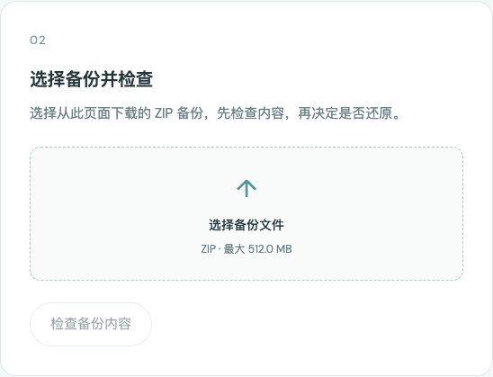

## 8. 编辑记录

1. 打开“编辑记录”，查看正式发布、下线、删除和网站备份还原的记录；保存或恢复草稿不会新增记录。
2. 输入条目名称或操作关键词、编辑人员姓名或用户名，选择内容类型，点击“筛选”。
3. 点击“查看 N 项修改”，比较各字段“修改前”和“修改后”。
4. 点击“定位条目”或“定位字段”，返回网页编辑中的对应位置。
5. 使用“上一页”“下一页”查看早期记录；点“刷新记录”获取最新操作。

当前尚未保存的修改在“变更清单”中查看；恢复过去的内容使用条目侧栏的“历史版本”。

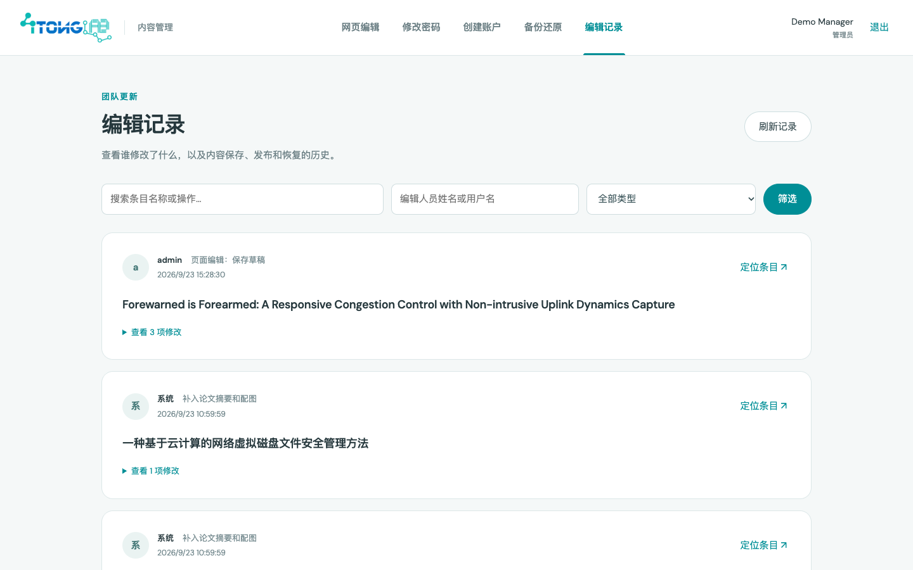

## 9. 无法登录时

同一账号或同一来源 IP 登录失败达到 5 次后会锁定；停止尝试 15 分钟自动解除。锁定期间继续尝试会重新计算等待时间，成功登录会清除对应失败计数。

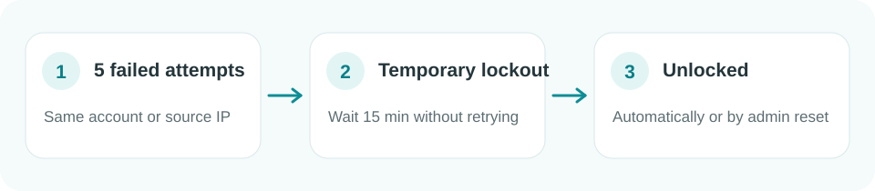

有服务器 SSH 权限的管理员可立即清除锁定。将 `LAB_SERVER` 改为有 sudo 权限的服务器登录地址，在终端执行：

```sh
LAB_SERVER='用户名@服务器地址'

# 解锁 admin
ssh -t "$LAB_SERVER" 'sudo sh /srv/litonglab/current/deploy/manage.sh axes_reset_username admin'

# 清除全部账号和 IP 的失败计数与锁定
ssh -t "$LAB_SERVER" 'sudo sh /srv/litonglab/current/deploy/manage.sh axes_reset'
```

忘记密码时，请其他管理员在“创建账户”中重置。若管理员账号也无法登录，在本地终端执行，按提示输入两次新密码：

```sh
ssh -t "$LAB_SERVER" 'sudo sh /srv/litonglab/current/deploy/manage.sh changepassword admin'
```
