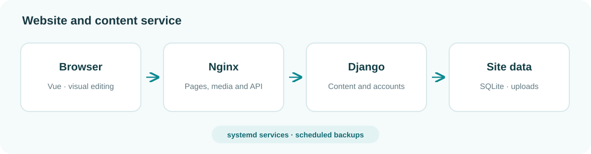
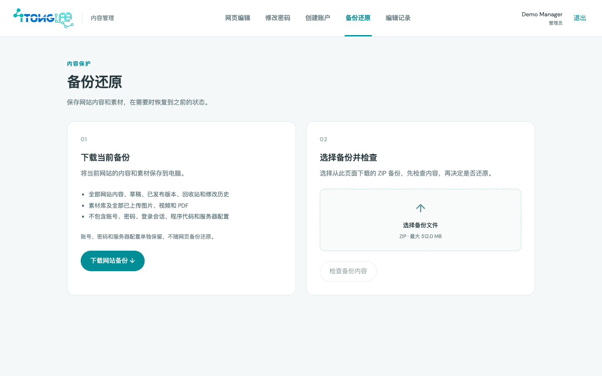

# LitongLab 项目介绍

LitongLab 实验室官网，用于展示研究方向、论文、成员、项目和新闻。官网与管理中心采用统一设计，日常内容可直接在网页上编辑、预览和发布。

同一套源码和部署包可用于不同的 Linux 服务器，部署时填写服务器地址和域名。


## 目录结构

```text
new-litonglab/
├── frontend/                 # Vue 前端
│   ├── src/
│   │   ├── views/            # 官网各页面
│   │   ├── components/       # 导航、轮播、论文条目等公共组件
│   │   ├── management/       # 登录与管理中心
│   │   ├── editor/           # 网页编辑、内容库与素材选择
│   │   ├── stores/           # 内容、语言和主题状态
│   │   ├── api/
│   │   ├── composables/
│   │   ├── styles/
│   │   ├── types/
│   │   ├── App.vue
│   │   ├── main.ts
│   │   └── router.ts
│   ├── public/               # 图片、字体、视频和论文 PDF
│   ├── package.json
│   └── vite.config.ts
├── backend/                  # Django 内容服务
│   ├── cms/                  # 内容、账户、发布、历史与备份业务
│   ├── config/               # 服务设置和接口路由
│   ├── manage.py
│   └── requirements.txt
├── content/seed/             # 首次安装导入的初始内容
├── scripts/                  # 初始化、开发启动、类型生成与打包工具
├── deploy/                   # Nginx、systemd 和环境变量配置
├── docs/                     # 四份文档及配图
├── var/                      # 数据库、上传素材与备份
└── package.json              # 项目统一命令入口
```

## 技术栈

| 部分         | 技术                                              |
| ------------ | ------------------------------------------------- |
| 前端         | Vue 3、TypeScript 6、Vue Router 5、Pinia 4、Axios |
| 网页编辑     | Tiptap 3、Vue 原位编辑组件                        |
| 构建与格式   | Vite 8、vue-tsc、Prettier、Ruff                   |
| 后端与数据库 | Python 3.10+、Django 5.2、SQLite                  |
| 部署         | Linux、Nginx、Gunicorn、systemd                   |



## 功能与特色

### 页面展示

- 首页校园与实验室照片短片、滚动渐变、实验室照片轮播、成员照片和项目配图；首屏资源就绪后再显示主页。
- 适配电脑和手机，支持中英文、明暗主题及平滑切换。


### 论文检索

- 按关键词、年份和类型筛选论文与专利。
- 展示作者、会刊简称、年份及 CCF 评级。每条成果有独立页面，可查看摘要、论文图、引用和资源链接。


### 网页编辑

- 在原网页维护论文摘要与配图，以及新闻、成员、项目、研究方向、首页展示、成员分组和会刊目录。
- 素材库统一管理合照上传、轮播开关和顺序；“加入我们”的文字与两处照片可直接点击编辑。
- 素材库统一管理图片、视频和 PDF，支持裁切、重命名、删除未使用的上传文件；支持条目排序、草稿预览和发布。
- 查看修改前后差异，定位并撤销修改，恢复历史版本或回收站条目。


### 团队管理

- 管理员创建、编辑、停用和删除账户；成员可修改自己的密码。
- 所有编辑人员均可发布内容，编辑记录保留操作者与修改详情。


### 备份还原

- 管理中心支持下载网站备份、校验备份和确认还原。
- 服务器定时备份数据库、账户和素材。



## 相比旧版官网的改进

### 展示更清晰

- 统一版式、字号和配色，增加图片、视频与过渡动画；手机端保持沉浸式首页。
- 论文题目、作者、时间、会刊、评级与 PDF 按统一结构展示，便于查找。

### 更新更方便

- 日常内容可在原网页编辑，保存并发布即可生效，无需重新打包前端。
- 修改有记录，误改可定位、撤销或恢复，方便实验室成员交接维护。

### 项目更易维护

- 官网、编辑器、管理中心和内容服务分别组织，便于修改和扩展。
- 运行数据与部署代码分开保存，更新程序时保留已有内容；更换服务器继续使用同一套项目。
